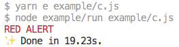
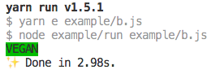

<a href="https://artdeco.bz/erte">

# erte</a>

`erte` is an npm package to show string difference with colour.

```sh
yarn add erte
```

## `erte(source: string, target: string): string`

This function will compare the strings using [`diff`][2] package, and color the
differences with green or red.

```js
import erte from 'erte'

const s = 'test this string'
const e = 'test this string with extra data'
const m = 'test this'

const green = erte(s, e)
console.log(green)

const red = erte(s, m)
console.log(red)

const grey = erte(s, s)
console.log(grey)
```


## c(s: string, t:'red'|'green'|'grey'): string

This function will color the foreground with red, green or grey colors.

```js
/** yarn example-c */
import { c } from 'erte'

const redText = c('RED ALERT', 'red')
console.log(`.${redText}`) // eslint-disable-line
```

```sh
yarn example-c
```



## b(s: string, t:'red'|'green'): string

This function will color the background with red or green colors.

```js
/** yarn example-b */
import { b } from 'erte'

const greenText = b('VEGAN', 'green')
console.log(`.${greenText}`) // eslint-disable-line
```

```sh
yarn example-b
```



---

(c) [Art Deco Code][1] 2018

[Artwork by Erte][3].

[1]: https://artdeco.bz
[2]: https://npmjs.org/package/diff
[3]: http://www.erte.com
